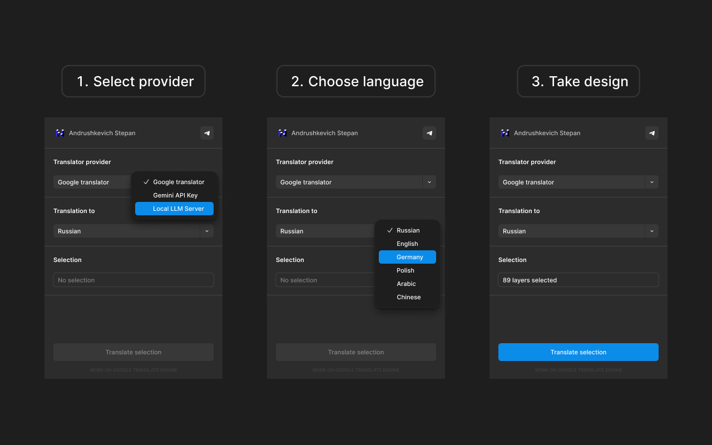

# Translator Lite

**Instant text translation in Figma using Google, Gemini, or your own local LLM server.**

## How it works

1. **Select provider** — choose between Google Translator (free, no key needed), Gemini API, or your own Local LLM Server
2. **Choose language** — pick a target language: Russian, English, German, Polish, Arabic, Chinese
3. **Select layers in Figma and click Translate** — the plugin finds all text layers in your selection and translates them instantly

## Features

- ✅ **Free option** — Google Translate works out of the box, no API key required
- 🔑 **Gemini API** — paste your Gemini API key for higher quality translations
- 🖥️ **Local LLM** — connect to your own LM Studio or any OpenAI-compatible local server (`http://localhost:1234/v1`)
- ⚡ **Batch translation** — translates all text layers in selection at once (tested with 89+ layers)
- 🎨 **Figma-native UI** — looks and feels like a native Figma panel
- 💾 **Settings saved** — your provider, API key, and server URL are saved between sessions

## Installation

1. Download or clone this repository
2. Open Figma → Plugins → Development → **Import plugin from manifest**
3. Select `manifest.json` from this folder
4. The plugin will appear in your development plugins

## Providers

| Provider | Key required | Quality | Speed |
|---|---|---|---|
| Google Translator | No | Good | Fast |
| Gemini API | Yes (free tier available) | Excellent | Fast |
| Local LLM Server | No (self-hosted) | Depends on model | Depends |

## Local LLM setup

The plugin connects to any OpenAI-compatible API. Default URL: `http://localhost:1234/v1`

Works with [LM Studio](https://lmstudio.ai/) and similar tools. Just start your local server and paste the URL in the plugin.

## Made by

[Andrushkevich Stepan](https://t.me/necrondesign)
